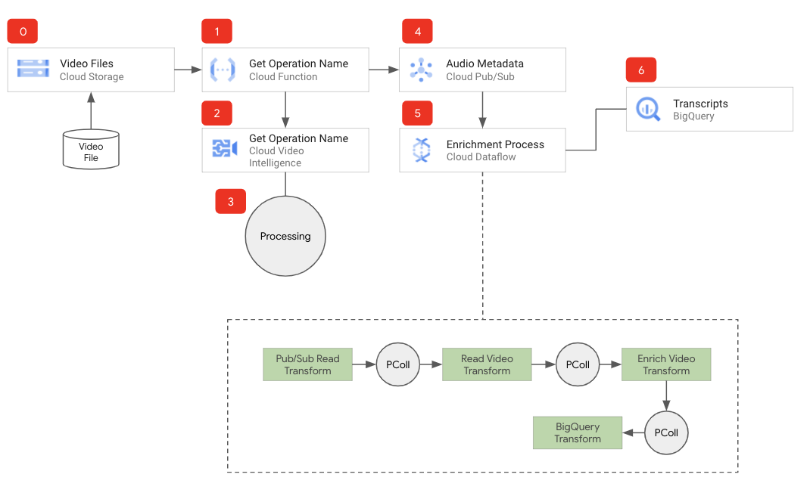
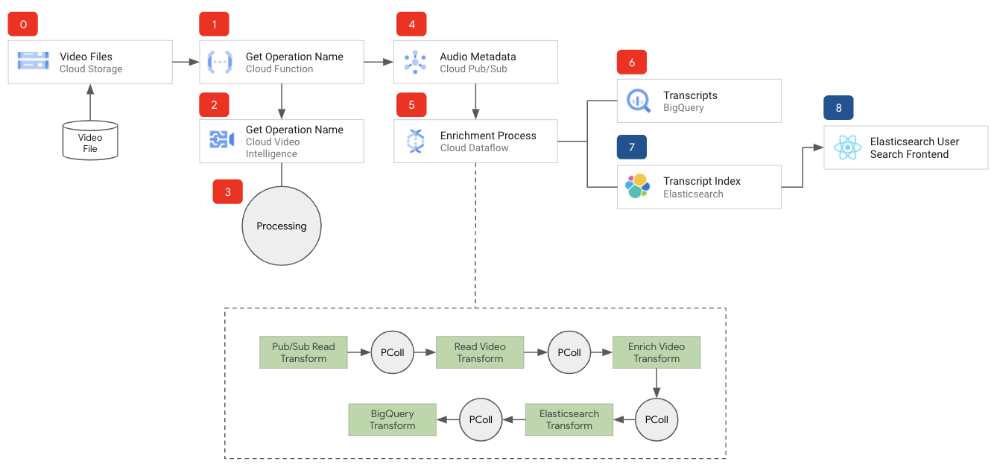

# Video Analysis (VIA) Framework

This repository contains the Video Analysis (VIA) Framework, a collection of Google Cloud services that you can use to transcribe video.



The repository also contains an extended version of the the Video Analysis (VIA) Framework which includes a collection of components including [Elasticsearch](https://www.elastic.co/) and a web interface that you can use to search for words and phrases within your videos.



It can:
* Process uploaded video files to Cloud Storage.
* Enrich the processed video files with Google Cloud Video Intelligence API.
* Write the enriched data to BigQuery.
* With the Extended version add the enriched data to Elasticsearch index and provide a user interface to search for words and phrases

The life of a video file with the VIA:

0. A video file is uploaded to Cloud Storage
1. The Cloud Function is triggered on object.create
2. The Cloud Function sends a long running job request to the Video Intelligence API
3. The Video Intelligence API starts processing the video file
4. The Cloud Function then sends the job ID from Video Intelligence API with additional metadata to Cloud Pub/Sub
5. The Cloud Dataflow job enriches the data
6. Cloud Dataflow then writes the data to Google Cloud BigQuery

__Extended Version:__ The life of a video file with the VIA:

Scroll to the bottom for instructions on how to install the extended version.

0. A video file is uploaded to Cloud Storage
1. The Cloud Function is triggered on object.create
2. The Cloud Function sends a long running job request to the Video Intelligence API
3. The Video Intelligence API starts processing the video file
4. The Cloud Function then sends the job ID from Video Intelligence API with additional metadata to Cloud Pub/Sub
5. The Cloud Dataflow job enriches the data
6. Cloud Dataflow then writes the data to Google Cloud BigQuery
7. Next step in the pipeline includes the data to be written to  Elasticsearch index
8. The data is now ready to be searched with Elasticsearch

## How to install the Video Analysis Framework

1. [Install the Google Cloud SDK](https://cloud.google.com/sdk/install)

2. Create a storage bucket for **Dataflow Staging Files**

``` shell
gsutil mb gs://[BUCKET_NAME]/
```

3. Through the [Google Cloud Console](https://console.cloud.google.com) create a folder named **tmp** in the newly created bucket for the DataFlow staging files

4. Create a storage bucket for **Uploaded Video Files**

``` shell
gsutil mb gs://[BUCKET_NAME]/
```

5. Create a BigQuery Dataset
``` shell
bq mk [YOUR_BIG_QUERY_DATABASE_NAME]
```

6. Create Cloud Pub/Sub Topic
``` shell
gcloud pubsub topics create [YOUR_TOPIC_NAME]
```

7. Enable Cloud Dataflow API
``` shell
gcloud services enable dataflow
```

8. Enable Cloud Video Intelligence API
``` shell
gcloud services enable videointelligence.googleapis.com
```

10. Deploy the Google Cloud Function
* In the cloned repo, go to the __via-longrun-job-func__ directory and deploy the following Cloud Function.
``` shell
gcloud functions deploy viaLongRunJobFunc --region=us-central1 --stage-bucket=[YOUR_UPLOADED_AUDIO_FILES_BUCKET_NAME] --runtime=nodejs8 --trigger-event=google.storage.object.finalize --trigger-resource=[YOUR_UPLOADED_AUDIO_FILES_BUCKET_NAME]
```

11. Deploy the Cloud Dataflow Pipeline
* python3 --version Python 3.7.8
* In the cloned repo, go to __via-longrun-job-dataflow__ directory and deploy the Cloud Dataflow Pipeline. Run the commands below to deploy the dataflow job.
``` shell
# Apple/Linux
python3 -m venv env
source env/bin/activate
pip3 install apache-beam[gcp]
pip3 install dateparser
```
* The Dataflow job will create the **BigQuery Table** you listed in the parameters.
* Please wait as it might take a few minutes to complete.
``` shell
python3 vialongrunjobdataflow.py --project=[YOUR_PROJECT_ID] --input_topic=projects/[YOUR_PROJECT_ID]/topics/[YOUR_TOPIC_NAME] --runner=DataflowRunner --temp_location=gs://[YOUR_DATAFLOW_STAGING_BUCKET]/tmp --output_bigquery=[DATASET NAME].[TABLE] --requirements_file="requirements.txt" --region=[GOOGLE_CLOUD_REGION]
```

## How to install the Extended version of the Video Analysis Framework

The VIA Framework requires you have an working Elasticsearch install, for more information visit [Managed Elasticsearch on Google Cloud](https://www.elastic.co/google-cloud)

1. [Install the Google Cloud SDK](https://cloud.google.com/sdk/install)

2. Create a storage bucket for **Dataflow Staging Files**

``` shell
gsutil mb gs://[BUCKET_NAME]/
```

3. Through the [Google Cloud Console](https://console.cloud.google.com) create a folder named **tmp** in the newly created bucket for the DataFlow staging files

4. Create a storage bucket for **Uploaded Video Files**

``` shell
gsutil mb gs://[BUCKET_NAME]/
```

5. Create a BigQuery Dataset
``` shell
bq mk [YOUR_BIG_QUERY_DATABASE_NAME]
```

6. Create Cloud Pub/Sub Topic
``` shell
gcloud pubsub topics create [YOUR_TOPIC_NAME]
```

7. Enable Cloud Dataflow API
``` shell
gcloud services enable dataflow
```

8. Enable Cloud Video Intelligence API
``` shell
gcloud services enable videointelligence.googleapis.com
```

10. Deploy the Google Cloud Function
* In the cloned repo, go to the __via-longrun-job-func__ directory and deploy the following Cloud Function.
``` shell
gcloud functions deploy viaLongRunJobFunc --region=us-central1 --stage-bucket=[YOUR_UPLOADED_AUDIO_FILES_BUCKET_NAME] --runtime=nodejs8 --trigger-event=google.storage.object.finalize --trigger-resource=[YOUR_UPLOADED_AUDIO_FILES_BUCKET_NAME]
```

11. Deploy the Cloud Dataflow Pipeline
* python3 --version Python 3.7.8
* In the cloned repo, go to __via-longrun-job-dataflow-extended__ directory and deploy the Cloud Dataflow Pipeline. 
* You need to edit the pipeline to include your Elasticsearch settings on line 100
* Run the commands below to deploy the dataflow job.
``` shell
# Apple/Linux
python3 -m venv env
source env/bin/activate
pip3 install apache-beam[gcp]
pip3 install dateparser
pip3 install elasticsearch
```
* The Dataflow job will create the **BigQuery Table** you listed in the parameters.
* Please wait as it might take a few minutes to complete.
``` shell
python3 viaextendedlongrunjobdataflow.py --project=[YOUR_PROJECT_ID] --input_topic=projects/[YOUR_PROJECT_ID]/topics/[YOUR_TOPIC_NAME] --runner=DataflowRunner --temp_location=gs://[YOUR_DATAFLOW_STAGING_BUCKET]/tmp --output_bigquery=[DATASET NAME].[TABLE] --requirements_file="requirements.txt" --region=[GOOGLE_CLOUD_REGION]
```

12. Deploy Search Interface
* In the cloned repo, go to the __via-web/src__ directory. Edit the __Settings.js__ file to include your Elasticsearch parameters.
* Run the commands below in the __via-web__ directory to deploy in the search interface.

``` shell
npm run build
gcloud app deploy
```

13. The Search Interface requires [Google Cloud Identity-Aware Proxy (IAP)](https://cloud.google.com/iap/docs/app-engine-quickstart#enabling_iap)

14. Browse to the newly created App Engine service URL.

## Notes
* To search for phrases enter your text string in quotes as:


* To search for multiple words enter your words separated by space as:


**This is not an officially supported Google product**